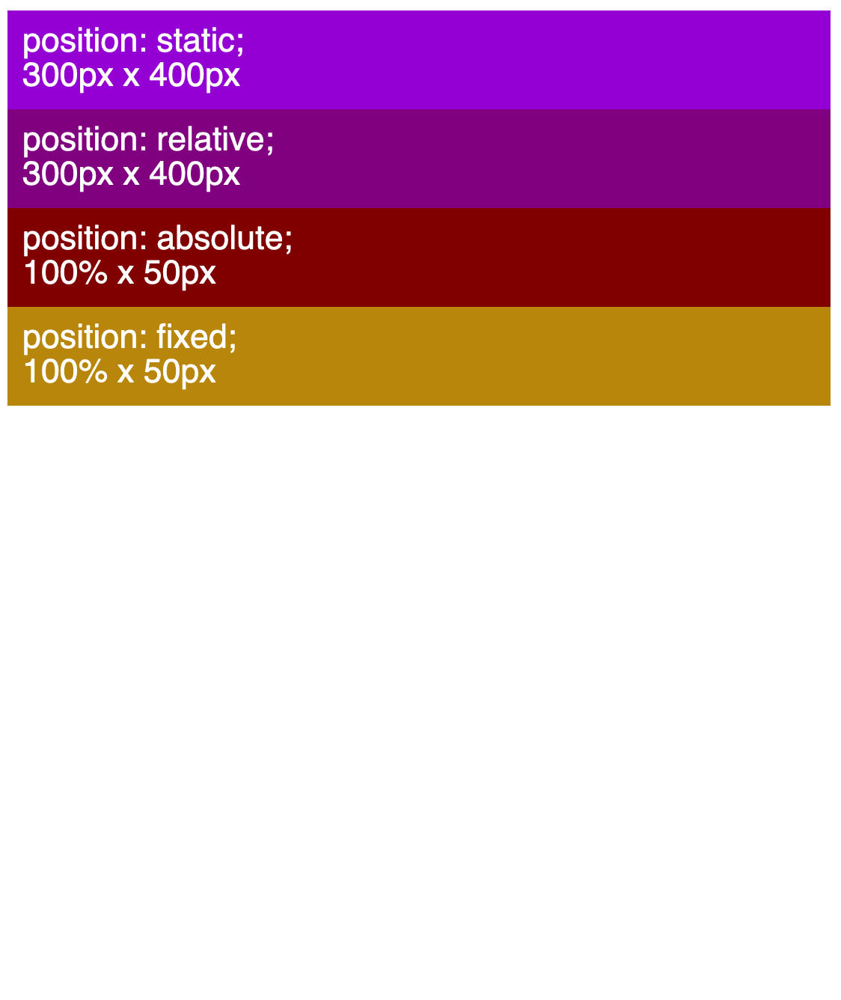

# CSS Exercises

- [CSS Exercises](#css-exercises)
  - [ Exercise 01 - Selectors](#-exercise-01---selectors)
  - [ Exercise 02 - Pseudo](#-exercise-02---pseudo)
  - [ Exercise 03 - Specificity](#-exercise-03---specificity)
  - [ Exercise 04 - Layout](#-exercise-04---layout)
  - [ Exercise 05 - Position](#-exercise-05---position)
  - [ Exercise 06 - Media Queries](#-exercise-06---media-queries)

## <a id="ex01"></a> Exercise 01 - Selectors

Recreate the snapshot below by using attribute, descendant, child, and sibling selectors.


## <a id="ex02"></a> Exercise 02 - Pseudo

Recreate the snapshot below using pseudo elements.


## <a id="ex03"></a> Exercise 03 - Specificity

Calculate the specificity of the rules below.

```css
nav .list-item > a {
}

#main::first-letter {
}

input[type] {
}

section .main::first-line {
}

nav ul.menu li#first a:not([class='visited']) {
}

div ol li ul li ol li ul li a {
}
```

## <a id="ex04"></a> Exercise 04 - Layout

Update the layout in the starter files to match the screenshots below.


## <a id="ex05"></a> Exercise 05 - Position

Update the layout in the starter files to match the screenshots below.





## <a id="ex06"></a> Exercise 06 - Media Queries

Update the layout in the starter files to match the screenshots below.


